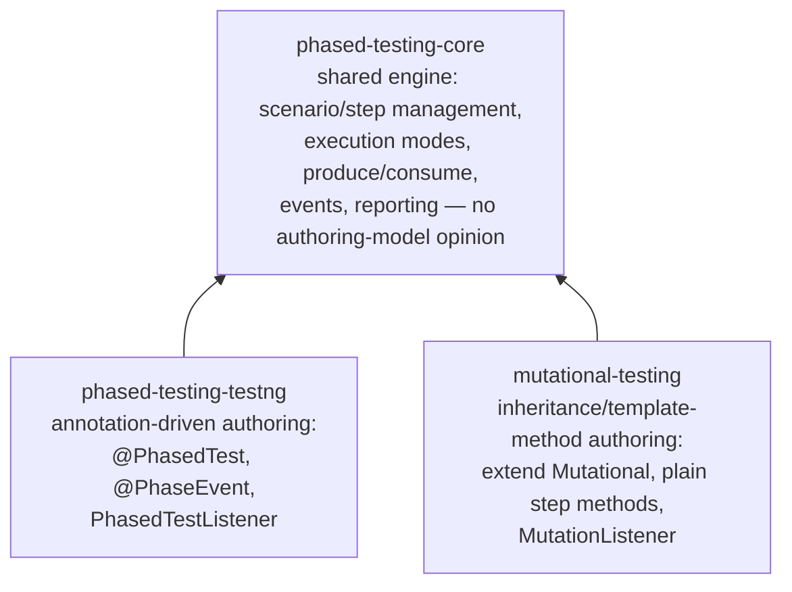

# Contributing

Thanks for choosing to contribute!

The following are a set of guidelines to follow when contributing to this project.

## Architecture
This repository is a multi-module Maven build. There are two ways to *author* a mutational test
scenario, sharing one common engine:

* **`phased-testing-testng`** is the original, annotation-driven authoring style: you write a plain class,
  annotate it `@PhasedTest`, and TestNG discovers and runs each `@Test` step method directly. This is
  documented in [Writing a Phased Test](README.md#writing-a-phased-test).
* **`mutational-testing`** is a newer, inheritance/template-method authoring style: your test class
  extends `Mutational`, its step methods are plain (non-`@Test`) methods, and a single template method
  drives their execution — including running them in every valid permutation. This is documented in
  [Writing a Mutational Test](README.md#writing-a-mutational-test).
* Both styles share the same underlying engine (`phased-testing-core`): the same execution modes, the same
  `produce`/`consume` context API, the same event model, and the same reporting.

You only need to depend on the module matching the authoring style you use — see [Installation](README.md#installation).
Neither `phased-testing-testng` nor `mutational-testing` depends on the other.

## Code Of Conduct

This project adheres to the Adobe [code of conduct](./CODE_OF_CONDUCT.md). By participating,
you are expected to uphold this code. Please report unacceptable behavior to
[Grp-opensourceoffice@adobe.com](mailto:Grp-opensourceoffice@adobe.com).

## Have A Question?

Start by filing an issue. The existing committers on this project work to reach
consensus around project direction and issue solutions within issue threads
(when appropriate).

## Contributor License Agreement

All third-party contributions to this project must be accompanied by a signed contributor
license agreement. This gives Adobe permission to redistribute your contributions
as part of the project. [Sign our CLA](https://opensource.adobe.com/cla.html). You
only need to submit an Adobe CLA one time, so if you have submitted one previously,
you are good to go!

## Code Reviews

All submissions should come in the form of pull requests and need to be reviewed
by project committers. Read [GitHub's pull request documentation](https://help.github.com/articles/about-pull-requests/)
for more information on sending pull requests.

Lastly, please follow the [pull request template](PULL_REQUEST_TEMPLATE.md) when
submitting a pull request!

## From Contributor To Committer

We love contributions from our community! If you'd like to go a step beyond contributor
and become a committer with full write access and a say in the project, you must
be invited to the project. The existing committers employ an internal nomination
process that must reach lazy consensus (silence is approval) before invitations
are issued. If you feel you are qualified and want to get more deeply involved,
feel free to reach out to existing committers to have a conversation about that.

### Commit Rules
All code pushed onto the repository must pass te following quality gates:
* Passed Unit Tests
* Code Coverage may not go down
* The sonar quality gate should remain green
* All new files need to contain the license header. This can be acheived by running `mvn license:format`.

These validations are done automatically through github actions.

### Java Version
Since our current users are still in java 11 the code needs to be able to compile in that version.

## Security Issues

Security issues shouldn't be reported on this issue tracker. Instead, [file an issue to our security experts](https://helpx.adobe.com/security/alertus.html).
