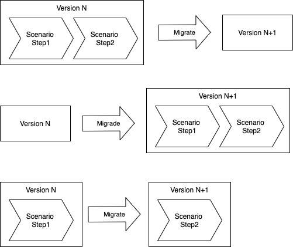
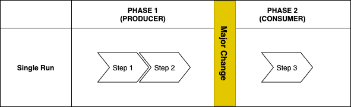
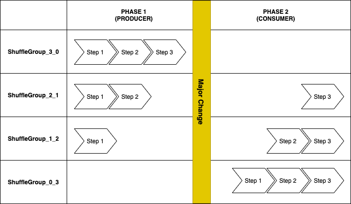
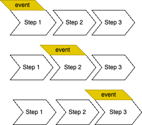
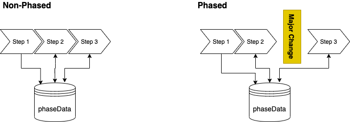

# PhasedTesting
[](https://github.com/adobe/phased-testing/actions/workflows/onPushSimpleTest.yml) 
[](https://codecov.io/gh/adobe/phased-testing)
[](https://javadoc.io/doc/com.adobe.campaign.tests.phased/phased-testing-testng)
[](https://sonarcloud.io/summary/new_code?id=adobe_phased-testing&branch=main)

Phased Testing has been created to address the issues related to Event Based Testing. Event Based Testing is a notion where tests adapt to external events, and allow you to simulate how your product reacts to an external event. 

Examples of events are:
* Upgrades
* Migrations
* Time-Consuming external Data process
* Load surges
* Service shut-downs

## Table of Contents
- [Problem Statement](#problem-statement)
  * [Interruptive Events](#interruptive-events)
  * [Non-Interruptive Events](#non-interruptive-events)
- [Installation](#installation)
  * [Maven](#maven)
- [Phases](#phases)
  * [Test Execution Modes](#test-execution-modes)
    + [Default Mode](#default-mode)
    + [Single Execution Mode](#single-execution-mode)
    + [Shuffled Execution Mode](#shuffled-execution-mode)
      - [Shuffled - Interruptive](#shuffled---interruptive)
      - [Shuffled - Non-Interruptive](#shuffled---non-interruptive)
- [Writing a Phased Test](#writing-a-phased-test)
  * [Setting Execution Modes](#setting-execution-modes)
    + [Shuffled Mode](#shuffled-mode)
    + [Single Run Mode](#single-run-mode)
  * [Local Execution](#local-execution)
  * [Non-Interruptive Events](#non-interruptive-events-1)
    + [Writing a Non-Interruptive Event](#writing-a-non-interruptive-event)
    + [Binding an Event to a Scenario](#binding-an-event-to-a-scenario)
    + [Attaching an Event using the PhaseEvent Annotation](#attaching-an-event-using-the-phaseevent-annotation)
    + [Attaching an Event using the PhasedTest Annotation](#attaching-an-event-using-the-phasedtest-annotation)
    + [Attaching an Event to the Test Suite](#attaching-an-event-to-the-test-suite)
  * [Before- and After-Phase Actions](#before--and-after-phase-actions)
  * [Nested Design Pattern](#nested-design-pattern)
- [Running a Phased Test](#running-a-phased-test)
  * [Run Time Properties](#run-time-properties)
  * [Executing a CONSUMER phase based on the PRODUCED Data](#executing-a-consumer-phase-based-on-the-produced-data)
  * [Execution Order](#execution-order)
- [Integrity between Steps and Scenarios](#integrity-between-steps-and-scenarios)
  * [Phase Contexts - Managing the Scenario Step Executions](#phase-contexts---managing-the-scenario-step-executions)
    + [On Failure](#on-failure)
    + [On Non-Execution of a Phase](#on-non-execution-of-a-phase)
  * [Managing Phased Data](#managing-phased-data)
    + [Simple Properties file - Default](#simple-properties-file---default)
    + [Phased Data Broker](#phased-data-broker)
- [Reporting](#reporting)
  * [Report By Phase Group and Scenario](#report-by-phase-group-and-scenario)
    + [Configuring Merged Reports](#configuring-merged-reports)
  * [Raw Reports](#raw-reports)
- [Misc](#misc)
  * [Data Providers](#data-providers)
- [Known Issues and Limitations](#known-issues-and-limitations)
  * [Parallel Testing](#parallel-testing)
  * [Retry Mechanisms](#retry-mechanisms)
- [Release Notes](#release-notes)
 
## Problem Statement
Phased Testing has been created to address the issues related to Event Based Testing. Event Based Testing is a notion where tests adapt to external events, and allow you to simulate how your product reacts to an external event. We identify two types of events:
* **_Interruptive events_** are cases such as system & application upgrades, system migrations and dependant service upgrades.
* **_Non-Interruptive events_** are cases such as system restarts, load injections and other unexpected events.

This library was originally created to help validate system changes such as upgrades and migrations.

### Interruptive Events
Interruptive events are cases such as system & application upgrades, system migrations and dependant service upgrades. Where the whole system requires a down-time in order to perform these events.
This library allows you to define tests in such a way, so that they can be interrupted at any point awaiting an event, and to carry on where they left off. More specifically based on your design the Phased tests will ensure that a scenario will work on an upgraded system no matter where it is interrupted.

This process can be used for validating :
* Upgrades
* Migrations
* Time-Consuming external Data process

Phased Testing, when testing Non-Interruptive events breaks down and reexecutes the tests in the way shown below: 



If we want to simulate all the use cases for a workflow of a user we will end up with too many duplicate code. This is why we came up with Phased Testing, which allows a scenario to cover all the possible steps in which a workflow can be interrupted.

### Non-Interruptive Events
Non-Interruptive events are cases such as system restarts, load injections and other unexpected events. These events do not require the whole system to restart. 

A typical use case for non-interruptive event is chaos testing.

## Installation
This version runs with the TestNG runner. You can use this library by including it in your project.

### Maven
The following dependency needs to be added to your pom file:

```
 <dependency>
    <groupId>com.adobe.campaign.tests.phased</groupId>
    <artifactId>phased-testing-testng</artifactId>
    <version>8.11.1</version>
</dependency>
```

### Demo
We have a standard demo that can be accessed through the [Phased Test Demo](https://github.com/baubakg/phased-test-demo).

## Phases
Phases are directives at execution time, where we let the system know, in what way we want our tests to interact with an event. 

We have four test phases:
* **Producer** In this Interruptive mode, the tests will stop before we execute the event. The tests prepare data to be used in the following test phase. The tests will be interr
* **Consumer** In this Interruptive mode, the tests will continue where they left off after the event has finished. The tests consume the data produced in the previous phase. 
* **Asynchrounous** In this Non-Interruptive mode, the events are executed in parallel to a step.
* * **Non-Phased** In this state, we have not designated a state, as such, if not unwanted, we execute all tests.

### Test Execution Modes
We have three modes of execution of a Phased Test:
* Default Mode
* Single Mode
* Shuffled Mode

#### Default Mode
The steps of each scenario are executed one by one without interruption.

#### Single Execution Mode
Single Execution Mode is used only when a workflow will always be interrupted at a given stage. This is particularly relevant when your scenario will expect a time concuming external process to finish. In this case we execute all steps till the Phase End marker. When in Consumer mode, we execute the rest of the steps.



The diagram above represents what will be executed by the following code:

```java
@Test
@PhasedTest
public class ShuffledTest {

    public void step1(String val) {
        PhasedTestManager.produce("step1Val","A");
    }

    public void step2(String val) {
        String l_fetchedValue = PhasedTestManager.consume("step1Val");
        PhasedTestManager.produce("step2Val",l_fetchedValue + "B");
        
    }
    
    @PhaseEvent

    public void step3(String val) {
        String l_fetchedValue = PhasedTestManager.consume("step2Val");
        assertEquals(l_fetchedValue, "AB");
    }
}
```

#### Shuffled Execution Mode
When in Shuffled mode, we execute all the possible ordered combinations of the steps.

The code below will react differently depending on the PHASE/Execution mode it is subject to :

```java
@Test
@PhasedTest
public class ShuffledTest {

    public void step1(String val) {
        PhasedTestManager.produce("A1");
    }

    public void step2(String val) {
        String l_fetchedValue = PhasedTestManager.consume("A1");
        PhasedTestManager.produce("B1",l_fetchedValue + "B");
        
    }

    public void step3(String val) {
        String l_fetchedValue = PhasedTestManager.consume("B1");
        assertEquals(l_fetchedValue, "AB");
    }
}
```

##### Shuffled - Interruptive
When a shuffled test is executed in an interruptive mode (Phases PRODUCER and CONSUMER), we execute all the possible ordered combinations interruptions the scenario can be subject to. Example Given a test with three steps, in Producer State, we :
1. Execute all the three steps
2. Execute the first two steps
3. Execute the first step only

When in Consumer state we :
1. Execute the two last steps
2. Execute the last step
3. Execute all the steps




##### Shuffled - Non-Interruptive 
As of version 8, we are introducing the asynchronous phase mode. Asynchronous phases are destined for non-interruptive events. They allow you to inject an event during the execution of the steps of a scenario. An asynchronous execution of a shuffled test, will shuffle the test, but will for each phase group execute, in parallel, the given event for each step.

Example:




## Writing a Phased Test
The Phased Testing is activated using two annotations:
* **@PhasedTest** : Class level annotation. Allows you to control how the test should be executed
* **@PhaseEvent** : Method level annotation. By setting it you tell the system at which step does the phase event happen. The tests will stop at that point.

Moreover, you need to :
* Make your methods accept at least one argument
* Due to the TestNG standards, the methods will be executed, by default in an alphabetical order. So prefixing the methods with their step number is a good practice. 

Note : As of version 7.0.11, we now have the possibility to let the framework pick the order for us.

### Setting Execution Modes

#### Shuffled Mode
In order for a test scenario to be executed in shuffle mode you need to add the following annotation at the class level `@PhasedTest`

#### Single Run Mode
In order for a test scenario to be executed in shuffle mode you simply need to set the annotation `@PhaseEvent` somewhere along its steps.  The location of this annotation is where you expect the interruption to occur..

Optionally if you consider that the scenario can never be run as non-phased, you need also include:  `@PhasedTest(executeInactive = false)`. When executeInactive is false, the Single Run scenario will only run when in Phases.

### Local Execution
Ideally you should set the default data provider on your tests. This allows you to execute the test locally without needing to force the Phased Test listener.

```
@Test( dataProvider = PhasedDataProvider.DEFAULT, dataProviderClass = PhasedDataProvider.class)
@PhasedTest
public class MyPhasedTest {
}
```

However, whenever the Phased Test Listener discovers a Phased Test, it will add the necessary data providers needed for running the test. But, ideally it is best to set the default providers in orrder to not lose the possibility of local execution.

### Non-Interruptive Events
In the case of non-interruptive events there are a few things to consider:
* Writing an Event
* Binding an Event to a Scenario

#### Writing a Non-Interruptive Event
In order have some level of predictability for non-interruptive events, we have defined an api for non-interruptive events. For an event to be able to be used by the Phased Tests it needs to inherit from the abstract class `com.adobe.campaign.tests.integro.phased.NonInterruptiveEvent` which extends `Runnable`.

In the example before we have created an event `NonInterruptiveEventExample`:
```java
public class NonInterruptiveEventExample extends NonInterruptiveEvent {
  @Override
  public boolean startEvent() {
    return false;
  }

  @Override
  public boolean isFinished() {
    return false;
  }

  @Override
  public boolean waitTillFinished() {
    return false;
  }
}
```

As you can see we have to implement three methods:
* `startEvent` starts the event.
* `isFinished` allow the system to see if the event we declared has finished.
* `waitTillFinished` waits until the event has finished.

In order to define these event you will need to implement these methods, as you who are defining the event have the best knowledge on how these event will work.

#### Binding an Event to a Scenario
In order for your scenario to interact with an event you will need to declare it. This can be done in three ways (in order of precedence) :
* Phased Event Annotation
* Phased Test Annotation
* Test Suite Definition

If you have the event declared in more than one level (for example on both the PhasedEvent and the PhasedTest annotation), it is the value with more precedence which is taken into account.

#### Attaching an Event using the PhaseEvent Annotation
The mode is only applicable to Single Run execution modes.

In the case of single run scenarios, we can specify which phase event should be triggered on the annotation itself. This is by setting the `eventClasses` attribute for the `@PhaseEvent` annotation.

In the example below the PhaseEvent is always executed at the step2 of the scenario. Here we have specified that when we are in asynchroous mode only the event `com.adobe.campaign.tests.integro.phased.data.events.MyNonInterruptiveEvent` should be executed. 
```Java
@PhasedTest
@Test
public class SingleRunScenarioWithEvent {

    public void step1(String val) {
        PhasedTestManager.produceInStep("A");
    }

    @PhaseEvent(eventClasses = {"com.adobe.campaign.tests.integro.phased.data.events.MyNonInterruptiveEvent"})
    public void step2(String val) {
        String l_fetchedValue = PhasedTestManager.consumeFromStep("step1");
        PhasedTestManager.produceInStep(l_fetchedValue + "B");
    }

    public void step3(String val) {
        String l_fetchedValue = PhasedTestManager.consumeFromStep("step2");

        assertEquals(l_fetchedValue, "AB");
    }
}
```

#### Attaching an Event using the PhasedTest Annotation
In this case we expect us to specify if a scenario is only subject to the same event. This will be done at the `@PhasedTest` annotation using the attribute `eventClasses`. When set we only use the specified event.

```Java
@PhasedTest(eventClasses = {"com.adobe.campaign.tests.integro.phased.data.events.MyNonInterruptiveEvent"})
@Test
public class ShuffledScenarioWithEvent {

    public void step1(String val) {
        PhasedTestManager.produce("step1Value","A");
    }
    
    public void step2(String val) {
        String l_fetchedValue = PhasedTestManager.consume("step1Value");
        PhasedTestManager.produce("Step2Value", l_fetchedValue + "B");
    }

    public void step3(String val) {
        String l_fetchedValue = PhasedTestManager.consume("Step2Value");

        assertEquals(l_fetchedValue, "AB");
    }
}
```

#### Attaching an Event to the Test Suite
In this case, we state that all scenarios should be using the same Event. We can activate this mode by setting the environment variable `PHASED.EVENTS.NONINTERRUPTIVE` to the event class.

This works for both Shuffled and Single-Run tests. If we want to run all tests with the event `com.adobe.campaign.tests.integro.phased.data.events.MyNonInterruptiveEvent`, we enter:

```mvn clean test -DPHASED.EVENTS.NONINTERRUPTIVE=com.adobe.campaign.tests.integro.phased.data.events.MyNonInterruptiveEvent```

You can also add it as a property in your testng definition file.

#### Targeting an Event to a Specific Step
As of version 8.11.2, we can inject an event to a specific step of a Phased Scenario. This is done by:
* Declaring an event by setting the variable `PHASED.EVENTS.NONINTERRUPTIVE`.
* Identifying the step on which an event will occur. This is done by setting the variable `PHASED.EVENTS.TARGET`.

The step should point to a method. For method `step1` in the class `a.b.c.ScenarioA` you can set:
* `a.b.c.ScenarioA.step1`
* `ScenarioA#step1`
* `ScenarioA.step1`

In the case of nested tests, for method `step1` in the class `a.b.c.ScenarioA`, and sub-class `NestedClassB` you need to use the `$` notation. It will look like:
* `a.b.c.ScenarioA$NestedClassB.step1`
* `ScenarioA$NestedClassB#step1`
* `ScenarioA$NestedClassB.step1`

Here is an example of running a specific event for a specific test:

```mvn clean test -DPHASED.EVENTS.NONINTERRUPTIVE=com.adobe.campaign.tests.integro.phased.data.events.MyNonInterruptiveEvent -DPHASED.EVENTS.TARGET=ScenarioA$NestedClassB#step1 ```


### Before- and After-Phase Actions
We have introduced the possibility of defining Before and After Phases. This means that you can state if a method can be invoked before or after the phased tests are executed. These methods are only activated when we are in a Phase, and will not run when executed when we execute the scenarios in Non-Phased mode. 

However, Before/After Phase methods are like any other Before/After method as, when invoked, they will affect all underlying tests, even if they are not Phased Tests.

To activate this functionality you add the annotations `@BeforePhase` & `@AfterPhase` to a TestNG configuration method such as: **@BeforeSuite, @AfterSuite, @BeforeGroups, @AfterGroups, @BeforeTest and @AfterTest**.

To your configuration method. Example:

```java
@BeforePhase
@BeforeSuite
public void myBeforePhaseSuite() {
    //Perform actions
}
```

In the example above the method `myBeforePhaseSuite` will be invoked in the beginning of the suite. By default, the BeforePhase method is invoked when we are in a Phase I.e. Producer or Consumer.

You can configure this with the attribute `appliesToPhases`, which accepts an array of `Phases`. In the example below we are activating AfterPhase for the Consumer phase only.


 ```java
@AfterPhase(appliesToPhases = {Phases.CONSUMER})
@AfterSuite
public void myAfterPhasedSuite() {
    //Perform actions
}
```

### Nested Design Pattern
As of version 7.0.9 of Phased Testing which is based on the 7.5 of TestNG, we can now define nested Phased tests. This allows you to regroup the phased tests under the same class. Thus, you will have Phased Tests that resemble method based tests.

Example:
```java
public class PhasedTestSeries_NestedContainer {
  @Test
  @PhasedTest
  public class PhasedScenario1 {

    public void step1(String val) {
      PhasedTestManager.produce("myValX","A");
    }

    public void step2(String val) {
      String l_fetchedValue = PhasedTestManager.consume("myValX");

      assertEquals(l_fetchedValue, "A");
    }
  }

  @Test
  @PhasedTest
  public class PhasedScenario2 {

    public void step1(String val) {
      PhasedTestManager.produce("MyVal1","AB");
    }
    
    public void step2(String val) {
      String l_fetchedValue = PhasedTestManager.consume("MyVal1");

      assertEquals(l_fetchedValue, "AB");
    }

  }

}
```

## Running a Phased Test
We are able to run tests in phases since each step stores the information needed for the following steps. For now this is done at the discretion of the developer. This storage is important as it helps us keep track of the tests:



Managing this data is obviously essential to the Phased Tests. We will discuss this in more detail in the chapter on "Managing Phased Data".

### Run Time Properties
We have the following system properties:
* PHASED.TESTS.PHASE
* PHASED.EVENTS.NONINTERRUPTIVE
* PHASED.TESTS.DATABROKER
* PHASED.TESTS.STORAGE.PATH
* PHASED.TESTS.OUTPUT.DIR
* PHASED.TESTS.RETRY.DISABLED
* PHASED.TESTS.REPORT.BY.PHASE_GROUP
* PHASED.TESTS.CODE.ROOT
* PHASED.TESTS.DETECT.ORDER
* PHASED.TESTS.NONPHASED.LEGACY

#### PHASED.TESTS.PHASE
We have four phased states:
1. **PRODUCER** : We produce information
2. **CONSUMER** : We consume information
3. **ASYNCHRONOUS** : We execute an event during a phase.
4. **NON_PHASED** : By default we execute all the steps in a phased test, unless the @PhasedTest has set the attribute **executeInactive** to "false"

#### PHASED.EVENTS.NONINTERRUPTIVE
This property is passed whenever we want to specify a non-interruptive event at run time. By passing the full name of the non-interruptive event, we can tell the system around which event our tests should be wrapped. 

#### PHASED.TESTS.DATABROKER
This parameter allows you to tell the PhaseTestManager which DataBroker implementation you want to use. The is usually a full class path (package name + class name). More on this will be dealt with in the chapter on Phased Data Broker.

#### PHASED.TESTS.STORAGE.PATH
This is the path in which the Phased Data is stored, and fetched. If not set, the path /phased_output/phased_tests/phaseData.properties will be used.

#### PHASED.TESTS.OUTPUT.DIR
By default, Phased Test data is stored under the directory phased_output. You can override this by setting this system property. If not set, the default directory phased_output will be used.

#### PHASED.TESTS.RETRY.DISABLED
By default, we deactivate retry analyzer for the phased tests. However, if you really want to use your retry listener, we can stop the phase test listener from deactivating it.

#### PHASED.TESTS.REPORT.BY.PHASE_GROUP
By default, we do not modify reports. Each step in a scenario is reported as is. We have introduced a "Report By Phase Group" functionality, which is activated with this property.

#### PHASED.TESTS.CODE.ROOT
As of version 7.0.11, we will be detecting the order based on the code. These rules are deduced by analyzing the test code. Since it is not easy to deduce, we require the user to set the root directory from whoch the sources can be found. This directory should point to le location from which the first package directory starts. 

#### PHASED.TESTS.DETECT.ORDER
As of version 7.0.11, we will be detecting the order based on the code. In 7.0.11, whenever this system property is set (the value is not important in this version), we execute the steps of a scenario based on their position within the class.

#### PHASED.TESTS.NONPHASED.LEGACY
For versions < 8.0.0 we had a bug where the default execution mode was executed in a phase group called "phased-data-provider-single". This was incorrect, and as of version 8.0.0 the default execution mode of a phased test is "phased-default". Due to backward compatibility, we allow users to keep the old mode if they chose to. 

### Executing a CONSUMER phase based on the PRODUCED Data
Usually when your test code is in the repository of the product being tested, you will be having a delta in tests between two versions **N** & **N+1**. In such cases you will want to only execute the tests that exist in both versions. 

For this, as of version 7.0.9, we have introduced the functionality that allows you to automatically select the phased tests that were executed in a previous phase. This means that when activated in a CONSUMER Phase, the selection is made based on the tests that were executed in the PRODUCER Phase. This functionality is activated when you pass or include the test group `PHASED_PRODUCED_TESTS`.

### Execution Order
By default, the phased tests, being implemented in TestNG follow the same rules as that test framework. This means that up to version 7.0.10 (included), the execution of the steps in a scenario follows an alphabetical rule.

As of version 8 we have implemented code based order. Whenever the system property, PHASED.TESTS.DETECT.ORDER is set, the steps are executed in the order the way we declared in the code. By default, we expect the code to be in maven where the tests are in the directory src/test/java. However, this can be overriden by setting the execution property PHASED.TESTS.CODE.ROOT.

## Integrity between Steps and Scenarios 
### Phase Contexts - Managing the Scenario Step Executions
Although we try to keep the execution of a scenario like any other test scenario, we feel that it is useful to document how the state of a scenario works.

#### On Failure
Whenever a scenario step fails the following steps are marked as SKIPPED.

#### On Non-Execution of a Phase
If a phase is not executed, the steps in the next phase are also SKIPPED.

### Managing Phased Data
The way data is stored between two phases is in two ways:
* Simple properties file (Default)
* Phased Data Broker

#### Simple Properties file - Default
At the end of the producer phase we store all the phase data in a properties file. By default it is stored under:
<STD Output directory>/phased_tests/phaseData.properties

When going to the consumer state all you need to do is to make sure that the file is available.

You can override the directory by setting the system property *PHASED.TESTS.STORAGE.PATH*.

#### Phased Data Broker
In this edition we have introduced the concept of a Phased Data Broker. This allows you to define how you want your phase data to be stored. The PhasedData listener still stores a local copy, but it will in fact use a broker that you have defined. 

For this you need to define a Class that implements the interface com.adobe.campaign.tests.integro.phasedPhasedDataBroker. 

The Phased Data Broker can then be attached to the test in three ways (in descending order):
1. Setting a system property PHASED.TESTS.DATABROKER with the class full name.
2. Configuring the property PHASED.TESTS.DATABROKER as a Test Suite parameter 
3. Programmatically by calling PhasedTestManager.setDataBroker()

## Reporting
In this chapter we discuss the test reports. We currently have two types of reports:
- Default Reports - Report By Phase Group and Scenario
- Raw Reports

### Report By Phase Group and Scenario
To make the reports a bit less messy, we introduced a report where, we only keep one result per Phase Group and Scenario. Technically, we keep the most pertinent result. 

These are the end results of a phased scenario and its Phase Group:
PRODUCER Phase Passed | CONSUMER Phase Passed | End Result
--------------------- | --------------------- | ----------
TRUE | TRUE | PASSED
FALSE | TRUE | SKIPPED
TRUE | FALSE | FAILED

The following use cases exist for a phase group.
- If all steps succeed, we keep the first step as the end result.
- If in the current phase we have a failure at step X, we only keep that step result. All following steps are discarded from the result. 
- If the phase group had failed in the previous phase, we keep the first step result which is "skipped". When failing due to a failure in the PRODUCER Phase, the skip message will contain the step and the phase in which the failure occurred. 
- Whenever an exception is encountered in a step, it is enriched with the step name and the phase in which it happened.
- The duration we report will be the full duration of the scenario which includes the steps on both phases.

The default behavior is we just show the phase group name. This can, however be configured. We will describe this process in more detail in the chapter [on how we can configure the Merged Reports](#configuring-merged-reports).

As of version 7.0.10 this report mode is the default report mode.

#### Configuring Merged Reports
By default, we store the Phase Groups whenever a Phased Test is run. However, we now have the possibility to override this. This is done by using the class `PhasedTestManager.MergedReportData.configureMergedReportName(Prefix Elements, Prefix Elements)`. This allows users to specify the Phased Test output.

The following configuration items can be added to the constructed name:
- **Phase** adds the phase name to the constructed method name
- **Phase Group** adds the phase group to the constructed method name
- **Scenario Name** adds the scenario name (the class) to the constructed method name
- **Data Provider** add the data providers, separated by "_" to the name 

### Raw Reports
We sometimes need to have an un polished report for debugging reasons. Therefore, we have introduced a raw report mode.By default, we only slightly modify how TestNG generates reports. As each step is a method, you will get one result per step. This will lead to a lot of results, but you will have the full overview of the evolution of the tests.

To activate this report, you need to set the system property PHASED.TESTS.REPORT.BY.PHASE_GROUP to "false".

## Misc
In this chapter we will deal with miscellaneous issues related to Phased Tests

### Data Providers
We now allow for a user to also include data providers in connection to Phased Tests. The Data Provider parameters will, when executed in a Phased Test, be added to the test result.

A configuration check is done in the beginning. The phased test steps are checked and their arguments are compared to the number of data providers + the injected data provider for phased tests. If the number of arguments does not correspond to the total number of data providers, a `PhasedTestConfigurationException` is thrown right at the beginning.

## Known Issues and Limitations
In this chapter we will share the functionalities that yet need to be implemented or fixed in the Phased Testing system. In most cases these issues are items which have not yet been tested, and we yet do not know or have not specified how they should work when we are in a phased execution. 

### Parallel Testing
For now, we do not know how parallel execution will work with phased tests. So ideally it is best to be avoided in this context. 

### Retry Mechanisms
For now, we have not come around to deciding how retry should work in the case of phased tests. By default, we deactivate them on the phased tests unless the user specifically chooses to activate them by setting the system property `PHASED.TESTS.RETRY.DISABLED` to false. 

## Release Notes

### 8.11.2
* [#178 Allowing the injection in any step of a scenario](https://github.com/adobe/bridgeService/issues/178). We can now inject an event into a step in an arbitrary phased test. This is done by setting the syetm property PHASED.EVENTS.TARGET. This way you can inject the event into that step.


### 8.11.1
* Renaming ConfigValueHandler to ConfigValueHandlerPhased
* Migrating to Java 11
* Upgrading the TestNG library to 7.8.0

### 8.0.0
* [Non-Interrupted Events](#Shuffled---Non-Interruptive)
* [#112](https://github.com/adobe/phased-testing/issues/112) Technical : Extracted the execution properties to the class ConfigValueHandler.
* [#115](https://github.com/adobe/phased-testing/issues/115) Fixed bug where the Non-Phased execution was stored as SINGLE-RUN. You can still keep the old behaviour by passing the property "PHASED.TESTS.NONPHASED.LEGACY" to "true". However by default they are stored as "phased-default".
* [#114](https://github.com/adobe/phased-testing/issues/114) Technical : The methods PhasedTestManager.isPhasedTestShuffledMode & PhasedTestManager.isPhasedTestSingleMode no longer take into account the current phase. Instead, they simply return the information about wether or not the given method/class is Shuffled or Single Mode.
* [Implementation of execution order detection base on the code.](#Execution-Order) We now have two options:
  * We continue as before, where we select the order alphabetically.
  * Whenever the system property, PHASED.TESTS.DETECT.ORDER is set, the steps are executed in the order the way we declared in the code. By default, we expect the coe to be in maven where the tests are in the directory src/test/java. However, this can be overriden by setting the eecution property PHASED.TESTS.CODE.ROOT (#5)
* [#116](https://github.com/adobe/phased-testing/issues/116) We are now removing the explicite "SingleRun" mode. 
  * All Phased Tests without a @PhaseEvent annotation next to a step are now considered as "Shuffled".
  * Any Phased Test with a @PhaseEvent annotation is a Singe Run test.
  * We have now deprecated the @PhasedTest "canShuffle" attribute.

### 7.0.10
- Reports are now merged by default (#56)
- Refactoring : cleaning up cyclomatic complexity in the code (#49).
- Fixed issue with the listener managing data providers for non-Phased tests (#75).

### 7.0.9
- Upgraded to TestNG 7.5
- Resolved case of Skip due to config issues, such as a failure in a BeforePhase method (#41)
- We no longer throw SkipExceptions in the OnStartTest. Instead, we set the status to Skipped (#42) 
- Consumer results can now contain the results of the PRODUCER phase (#34) 
- Storing duration and the phase in the scenario state (#36) 
- Updated Log4J to 2.17.1 to resolve security issues (#38)
- Implemented the new select tests to run based on the producer phase (#9)
- Solved case when the users really wants to use retry. In this case we do not interrupt the retry mechanism.
- Moved back to java 8. We now compile the artefacts in java 8. This is because our main users are not yet in higher java versions.
- Removed the deprecated methods `PhasedTestManager.produceWithKey` and `PhasedTestManager.consumeWithKey`. 

### 7.0.8
- Upgraded java version to Java 11
- Activated sonar scans
- Solved Sonar highlighted bugs #20, #21, #23, #24
- Fixed issue #28 where the skip message when no steps have been executed previously for the current scenario phase group happens

### 7.0.7
- Migrated to the public git repository.

### 7.0.5
- You can now define Phase setup methods. `@BeforePhase` & `@AfterPhase` can be set on a normal TestNG Before and After method. The method will then be executed in before or after a phase starts. (#40) 
- We now allow for user defined data providers in a phased test. For the data provider to be considered, it needs to be declared at class level and not at method level. (#26)
- We can now configure the reports to include the data providers.
- We now throw an error if the arguments of the phased steps do not correspond to expected number of parameters (phased + user defined) (#28 & #27 & #38)
- Solved issue with tests continuing in consumer mode even if their steps had not been executed in the producer phase

### 7.0.4
- Introduced the Report by Phase Group Functionality (#5)
- Allowing users to configure the Merged Reports
- Other issues corrected are : #20, #22, #23, #24, #25

### 7.0.3
- Renamed old produce/consume to produceInStep/consumeFromStep. The old produceWithKey/consumeWith key are now deprecated. Instead you should use produceWithKey/consumeWith (#15) 
- We can now export the phase cache at will. This is very useful for debugging or for Data Broker testing. Added a method PhasedTestManager.fetchExportFile which help return the selected export file (#8)

### 7.0.0
- Migrated to TestNG 7.4

### 1.0.0
- First Release

