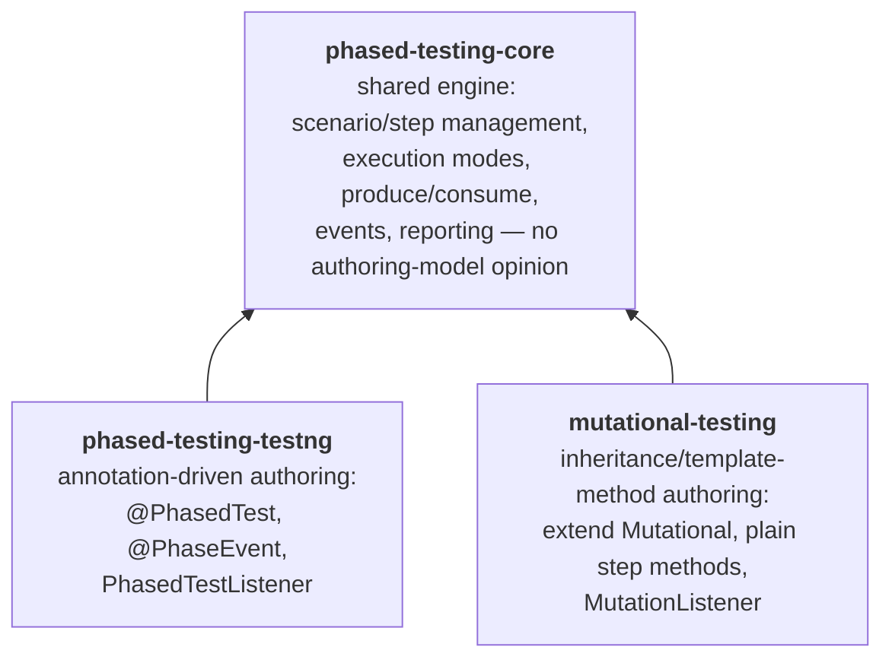
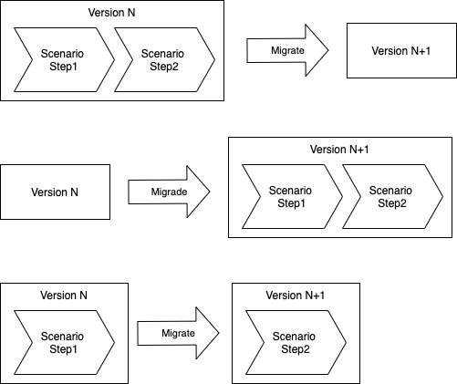
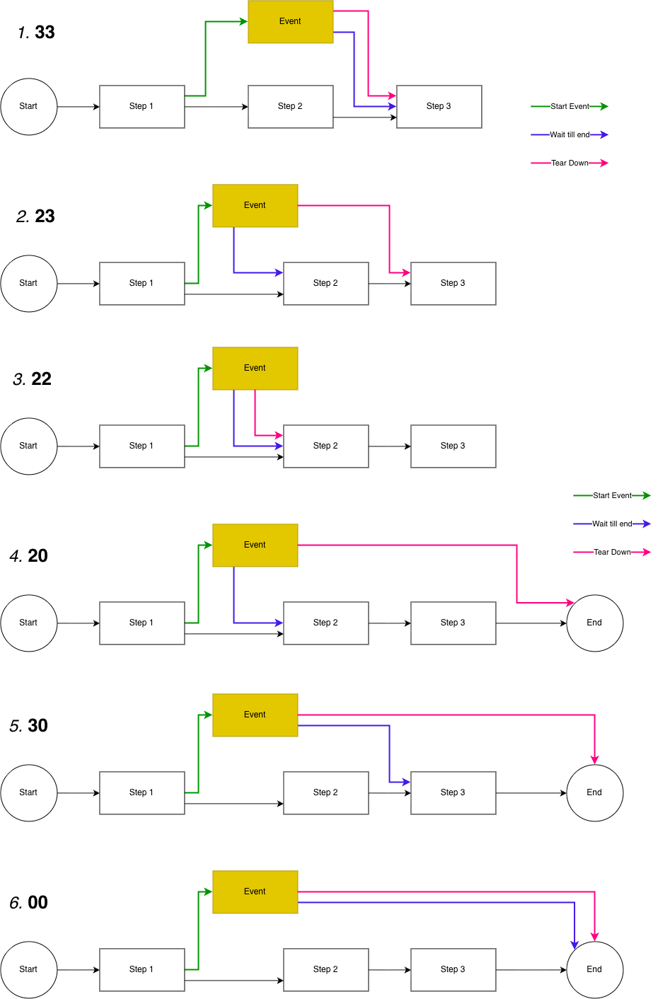
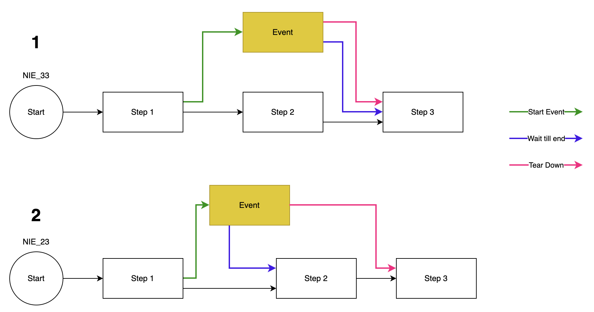
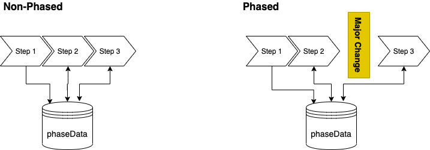
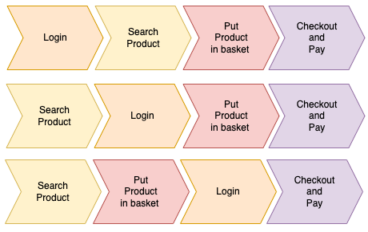

# PhasedTesting

[](https://github.com/adobe/phased-testing/actions/workflows/onPushSimpleTest.yml)
[](https://codecov.io/gh/adobe/phased-testing)
[](https://javadoc.io/doc/com.adobe.campaign.tests.phased/phased-testing-testng)
[](https://sonarcloud.io/summary/new_code?id=adobe_phased-testing&branch=main)

Mutational Tests (aka Phased Tests) is a framework, built upon TestNG, that allows test scenarios to "mutate". This means that a given scenario can, when needed,change its structure and order, i.e. “mutate”, to address the challenges that are imposed on it.

The mutational test methods help solve problems such as:

- Software Migration testing
- Software Upgrade testing
- Chaos testing
- End-User testing

This root document covers the **concepts** shared by both authoring styles, and the **shared engine
reference** (execution modes, run-time configuration, reporting, data management). The two authoring guides
live with their modules:

- [Mutational Testing](mutational-testing/README.md) — the recommended, inheritance-based style.
- [Phased Testing (TestNG)](phased-testing-testng/README.md) — the legacy, annotation-driven style.

## Table of Contents

<!-- TOC -->

- [Architecture](#architecture)
- [Problem Statement](#problem-statement)
  - [Events](#events)
    - [Interruptive Events](#interruptive-events)
    - [Non-Interruptive Events](#non-interruptive-events)
  - [Permutations](#permutations)
  - [None](#none)
- [Authoring a Scenario](#authoring-a-scenario)
  - [Which module do I use?](#which-module-do-i-use)
- [Installation](#installation)
  - [Maven](#maven)
- [Demo](#demo)
- [Event Management and Execution](#event-management-and-execution)
  - [Wrapping an Event Around a Step](#wrapping-an-event-around-a-step)
- [Execution Modes and Configuration](#execution-modes-and-configuration)
  - [Execution Modes](#execution-modes)
    - [STANDARD Execution Mode](#standard-execution-mode)
    - [INTERRUPTIVE Execution Mode](#interruptive-execution-mode)
    - [NON-INTERRUPTIVE execution mode](#non-interruptive-execution-mode)
    - [PERMUATIONAL Execution Mode](#permuational-execution-mode)
  - [Run Time Properties](#run-time-properties)
    - [MUTATIONAL.EXECUTION.MODE](#mutationalexecutionmode)
    - [PHASED.TESTS.PHASE (DEPRECATED)](#phasedtestsphase-deprecated)
    - [MUTATIONAL.EVENTS.NONINTERRUPTIVE](#mutationaleventsnoninterruptive)
    - [MUTATIONAL.EVENTS.TARGET](#mutationaleventstarget)
    - [MUTATIONAL.TESTS.DATABROKER](#mutationaltestsdatabroker)
    - [MUTATIONAL.TESTS.STORAGE.PATH](#mutationalteststoragepath)
    - [MUTATIONAL.TESTS.OUTPUT.DIR](#mutationaltestsoutputdir)
    - [MUTATIONAL.TESTS.RETRY.DISABLED](#mutationaltestsretrydisabled)
    - [MUTATIONAL.TESTS.REPORT.BY.PHASE_GROUP](#mutationaltestsreportbyphase_group)
    - [MUTATIONAL.TESTS.CODE.ROOT](#mutationaltestscoderoot)
    - [MUTATIONAL.TESTS.DETECT.ORDER](#mutationaltestsdetectorder)
  - [Executing a CONSUMER phase based on the PRODUCED Data](#executing-a-consumer-phase-based-on-the-produced-data)
  - [Execution Order](#execution-order)
  - [Running Nested Phased Tests](#running-nested-phased-tests)
  - [LEGACY PHASES - DEPRECATED](#legacy-phases---deprecated)
- [Integrity between Steps and Scenarios](#integrity-between-steps-and-scenarios)
  - [Phase Contexts - Managing the Scenario Step Executions](#phase-contexts---managing-the-scenario-step-executions)
    - [On Failure](#on-failure)
    - [On Non-Execution of a Phase](#on-non-execution-of-a-phase)
  - [Managing Phased Data](#managing-phased-data)
    - [Simple Properties file - Default](#simple-properties-file---default)
    - [Phased Data Broker](#phased-data-broker)
- [Reporting](#reporting)
  - [Report By Phase Group and Scenario](#report-by-phase-group-and-scenario)
    - [Configuring Merged Reports](#configuring-merged-reports)
  - [Raw Reports](#raw-reports)
- [Known Issues and Limitations](#known-issues-and-limitations)
  - [Parallel Testing](#parallel-testing)
  - [Retry Mechanisms](#retry-mechanisms)
- [Release Notes](#release-notes)
<!-- TOC -->

## Architecture

As of version 9.0.0, this repository is a multi-module Maven build. There are two ways to _author_ a
mutational test scenario, sharing one common engine:


```mermaid
graph BT
    core["<b>phased-testing-core</b><br/>shared engine: scenario/step management,<br/>execution modes, produce/consume,<br/>events, reporting — no authoring-model opinion"]
    testng["<b>phased-testing-testng</b><br/>annotation-driven authoring:<br/>@PhasedTest, @PhaseEvent,<br/>PhasedTestListener"]
    mutational["<b>mutational-testing</b><br/>inheritance/template-method authoring:<br/>extend Mutational, plain step methods,<br/>MutationListener"]

    testng --> core
    mutational --> core
```

- **`mutational-testing`** is the recommended, inheritance/template-method authoring style: your test class
  extends `Mutational`, its step methods are plain (non-`@Test`) methods, and a single template method
  drives their execution — including running them in every valid permutation. This is documented in
  [Mutational Testing](mutational-testing/README.md).
- **`phased-testing-testng`** is the original, annotation-driven authoring style: you write a plain class,
  annotate it `@PhasedTest`, and TestNG discovers and runs each `@Test` step method directly. This is
  documented in [Phased Testing (TestNG)](phased-testing-testng/README.md).
- Both styles share the same underlying engine (`phased-testing-core`): the same execution modes, the same
  `produce`/`consume` context API, the same event model, and the same reporting.

You only need to depend on the module matching the authoring style you use — see [Installation](#installation).
Neither `phased-testing-testng` nor `mutational-testing` depends on the other.

## Problem Statement

Mutational Tests (aka Phased Tests) is a framework, built upon TestNG, that allows test scenarios to "mutate". This means that a given scenario can, when needed,change its structure and order, i.e. “mutate”, to address the challenges that are imposed on it.

The mutational test methods help solve problems such as:

- Software Migration testing
- Software Upgrade testing
- Chaos testing
- End-User testing

Mutations are currently of the following types:

- Events: Events taking place during the execution of tests
- Permutations: The user may take a different path than originally intended
- None : The normal execution of tests (no mutations)


Our philosophy is that normal tests should be able to run as they are, but when needed, they should be able to adapt to the situation. A test will be executed as usual on a day-to-day basis, and will test a given functionality. However, when required, it will adapt, and change the way it is executed, in order to help us better test our products.

### Events

This framework was originally, and was created to address the issues related to Events in a system. Event Based Testing is a notion where tests adapt to external events, and allow you to simulate how your product reacts to an external event. We identify two types of events:

- **_Interruptive events_** are cases such as system & application upgrades, system migrations and dependant service upgrades.
- **_Non-Interruptive events_** are cases such as system restarts, load injections and other unexpected events.

The mutational tests allow us to assess the effect of an event on a scenario no matter where along the scenario execution it takes place.

#### Interruptive Events

Interruptive events are cases such as system & application upgrades, system migrations and dependant service upgrades. Where the whole system requires a down-time in order to perform these events.
This library allows you to define tests in such a way, so that they can be interrupted at any point awaiting an event, and to carry on where they left off. More specifically based on your design the Phased tests will ensure that a scenario will work on an upgraded system no matter where it is interrupted.

This process can be used for validating :

- Upgrades
- Migrations
- Time-Consuming external Data process

Phased Testing, when testing Interruptive events breaks down and reexecutes the tests in the way shown below:



If we want to simulate all the use cases for a workflow of a user we will end up with too many duplicate code. This is why we came up with Phased Testing, which allows a scenario to cover all the possible steps in which a workflow can be interrupted.

#### Non-Interruptive Events

Non-Interruptive events are cases such as system restarts, load injections and other unexpected events. These events do not require the whole system to restart.

A typical use case for non-interruptive event is chaos testing.

This process can be used for validating resilience due to the injection of events during the execution of a scenario. Examples are

- Real-time Upgrades
- Load surges during the execuion of a scenario
- A driverless car that needs to react to a sudden event

### Permutations

Permutations is the process of detecting all the possible paths a scenario can take. This is done by identifying the dependencies between each step, and creating the possible orders of that scenario.

Mutationa testing allows us to make sure that all possible permutations of a scenario is checked.

This is particularily usefull for covering all the possible paths a functional scenario can take.

### None

None refers to the absence of a mutation. A scenario that is not currently being affected by an Event or a Permutation runs exactly as it was written, i.e. in its normal, unmutated order.

This is the default state of any scenario, and is internally represented by `ExecutionMode.STANDARD`. Every scenario can run in this mode day-to-day, and only mutates into an Event or a Permutation when the corresponding conditions are triggered.

## Authoring a Scenario

Whatever mutation a scenario is subject to, the authoring model underneath is the same: **a scenario is a
class, and its steps are the methods of that class.** This is the one structural invariant shared by both
authoring styles. Because steps are clearly separated methods with clear boundaries, the engine can reorder
them, interrupt between them, and inject events around them.

Steps communicate through a shared context using `PhasedTestManager.produce(...)` and
`PhasedTestManager.consume(...)`. This produce/consume relationship is what lets the engine store state
across an interruption, and what it analyses to work out which orderings of a scenario are valid.

The two modules differ only in _how you declare that class and those steps_:

### Which module do I use?

|                 | [Mutational Testing](mutational-testing/README.md) _(recommended)_ | [Phased Testing (TestNG)](phased-testing-testng/README.md) _(legacy)_ |
| --------------- | ------------------------------------------------------------------ | --------------------------------------------------------------------- |
| Authoring style | Inheritance / template-method                                      | Annotation-driven                                                     |
| Test class      | `extends Mutational`                                               | Plain class annotated `@PhasedTest`                                   |
| Steps           | Plain public methods (no `@Test`)                                  | Discovered as TestNG `@Test` methods                                  |
| Step execution  | Driven reflectively by `Mutational.scenario(...)`                  | Run directly by TestNG                                                |
| Listener        | `MutationListener`                                                 | `PhasedTestListener`                                                  |
| Step ordering   | Always code-detected from produce/consume                          | Alphabetical by default, code-detected opt-in                         |
| Permutations    | First-class                                                        | Not the primary use case                                              |
| Artifact        | `mutational-testing`                                               | `phased-testing-testng`                                               |

Both share the same core engine, so the execution modes, run-time configuration, reporting and data
management below apply identically regardless of the module you pick.

## Installation

This version runs with the TestNG runner. You can use this library by including it in your project.

As of version 9.0.0, the project is split into multiple Maven modules sharing a common core engine
(`phased-testing-core`), so that the annotation-driven "Phased Testing" authoring model and the
inheritance/template-method-driven "Mutational Testing" authoring model can be released and depended on
independently. `phased-testing-core` is a transitive dependency of both and does not need to be declared
explicitly.

### Maven

If you write tests using the `Mutational` base class (inheritance/template-method model, permutations,
`MutationListener`), add:

```
 <dependency>
    <groupId>com.adobe.campaign.tests.phased</groupId>
    <artifactId>mutational-testing</artifactId>
    <version>9.0.0</version>
</dependency>
```

If you write tests using the classic `@PhasedTest` annotation model (`PhasedTest`, `@PhaseEvent`,
`PhasedTestListener`, `PhasedDataProvider`), add:

```
 <dependency>
    <groupId>com.adobe.campaign.tests.phased</groupId>
    <artifactId>phased-testing-testng</artifactId>
    <version>9.0.0</version>
</dependency>
```

You can declare both dependencies together if your project uses both authoring styles.

## Demo

We have a standard demo that can be accessed through the [Phased Test Demo](https://github.com/baubakg/phased-test-demo).

## Event Management and Execution

Events are an important topic, and have to be correctly covered. An event in Mutational Testing contains three parts:

- StartUp - the event is initiated.
- waitTillStarted - the startUp stage has been finalized
- tearDown - the system is set to a stable state

These parts of an event allow us to pilot the event injection around the scenario.

The general goal is that an event is started alongside a step, and the scenario waits for
the event to finish before it is allowed to affect a later point in the scenario:



In practice there are several ways to pilot exactly *when* the event's completion is waited
for and *when* its tear-down happens. [#203](https://github.com/adobe/phased-testing/issues/203)
identifies six such wrappings, referred to there as `NIE_xx` (e.g. `NIE_33`, `NIE_23`) — that
naming is only used in the issue tracker and diagrams, **not** in actual configuration; at
run time each wrapping is selected via the plain numeric behavior code, e.g.
`NON-INTERRUPTIVE(33)` (see [NON-INTERRUPTIVE execution mode](#non-interruptive-execution-mode)
for the full table and exact syntax).

Of those six, behaviors `33` and `23` are currently implemented
(see [#197](https://github.com/adobe/phased-testing/issues/197)):



The remaining four behaviors (`22`, `20`, `30`, `00`) are not yet implemented — see
[#256](https://github.com/adobe/phased-testing/issues/256),
[#257](https://github.com/adobe/phased-testing/issues/257),
[#258](https://github.com/adobe/phased-testing/issues/258) and
[#259](https://github.com/adobe/phased-testing/issues/259).

### Wrapping an Event Around a Step

Regardless of authoring style, an event is wrapped around a single step by two calls into
the shared core engine, keyed by the step's identity:

- `PhasedEventManager.startEvent(...)` is called right **before** the step runs. It
  instantiates and starts the `NonInterruptiveEvent`, and waits until it has left its initial
  `DEFINED` state (i.e. it has begun running, or failed outright) before letting the step
  proceed.
- `PhasedEventManager.finishEvent(...)` is called right **after** the step finishes. It waits
  for the event to report it has started (`waitTillStarted`), confirms it has finished
  (`isFinished`), and then runs its `tearDownEvent` clean-up.

Where exactly these two calls sit relative to the step's own execution — i.e. whether
`finishEvent`'s wait happens before or after the step's body runs — is what the
[NON-INTERRUPTIVE behaviors](#non-interruptive-execution-mode) (`23` vs `33`) control.

Both authoring styles call the exact same core API, just from different places:

- **Phased Testing (TestNG, annotation-driven)**: the `PhasedTestListener` calls
  `startEvent` from `onTestStart`, before the step runs, and `finishEvent` from
  `standardPostTestActions` (invoked by `onTestSuccess`/`onTestFailure`/`onTestSkipped`),
  after the step runs.
- **Mutational Testing (inheritance-based)**: `Mutational.execute()`'s step loop calls
  `startEvent` immediately before invoking the step method, and `finishEvent` immediately
  after, inline in the same loop — there is no listener involved.

How you attach an event to a scenario depends on the authoring style: the annotation-driven approach is
covered in [Binding an Event to a Scenario](phased-testing-testng/README.md#binding-an-event-to-a-scenario),
and the property-driven approach in
[Non-Interruptive Events (Mutational)](mutational-testing/README.md#non-interruptive-events).

## Execution Modes and Configuration

This chapter covers the shared engine configuration used by both authoring styles — Phased and
Mutational tests are both executed and configured the same way. We are able to run tests in phases since
each step stores the information needed for the following steps. For now this is done at the discretion of the developer. This storage is important as it helps us keep track of the tests:



Managing this data is obviously essential to the Phased Tests. We will discuss this in more detail in the chapter on "Managing Phased Data".

### Execution Modes

We currently have 4 execution modes:

- STANDARD
- INTERRUPTIVE
- NON-INTERRUPTIVE
- PERMUTATIONAL

The execution mode is set by passing the config value "MUTATIONAL.EXECUTION.MODE" at execution time.

Some execution modes have a notion of a "behavior" which add more details to the system as to how the tests should be executed. The behavior is set by passing the behavior within parenthesis.

#### STANDARD Execution Mode

This is the default execution mode. By default, we execute the scenario in the order and manner in which it was defined.

#### INTERRUPTIVE Execution Mode

The INTERRUPTIVE execution mode simulates the system being subject to an interruptive event.

The Phased Testing framework was originally devised for Interruptive Events, i.e. you need to stop a system so that you can perform some system change, such as an upgrade, to that system. Once the upgrade is done, we expect that the users can carry on with what they were doing.

The execution of steps in interruptive events is divided into two phases/behaviors depending on their execution relative to the interruptive event. The phase before the event is called “producer”, because the steps executed before the event produce data used after the event has taken place. Similarly, the phase after the event is called “consumer” because the steps rely on data created in the phase before the execution of the event.

| NAME     | When Passing          | Description                                                                                                                          |
| -------- | --------------------- | ------------------------------------------------------------------------------------------------------------------------------------ |
| PRODUCER | INTERUPTIVE(PRODUCER) | The tests will stop before we execute the event. The tests prepare data to be used in the following test phase.                      |
| CONSUMER | INTERUPTIVE(CONSUMER) | The tests will continue where they left off after the event has finished. The tests consume the data produced in the previous phase. |

#### NON-INTERRUPTIVE execution mode

A NON-INTERRUPTIVE execution mode is used when we want to inject an event in the middle of the execution of a scenario. Non-Interruptive events allow us to see the effects of parallel events.

This execution mode is a good way of performing chaos testing.

This mode is activated by setting the environment variable "MUTATIONAL.EXECUTION.MODE" to "NON-INTERRUPTIVE".

The event can be piloted with the following behaviors, passed as a plain number in
parenthesis, e.g. `NON-INTERRUPTIVE(33)` (this is the actual, only supported syntax — the
`NIE_xx` naming used in [#203](https://github.com/adobe/phased-testing/issues/203) and its
diagrams is just shorthand for talking about these behaviors, not something you type into
configuration). Only `33` and `23` are implemented today
([#197](https://github.com/adobe/phased-testing/issues/197)); the other four are tracked as
separate issues:

| Behavior | Implemented | Event Start | Event Finish (wait point) | Tear Down | Notes |
| -------- | ----------- | ----------- | -------------------------- | --------- | ----- |
| `33` (default) | ✅ Yes | Before the step | After/during the step | After the step | The event is started before the step runs, but the step does not wait for it. Once the step finishes, we wait for the event to confirm it has started, verify it has finished, and then tear it down, before moving on to the next step. |
| `23` | ✅ Yes | Before the step | Before the step's body runs | After the step | Synchronous variant. Before the step is allowed to run, we force a wait for the event to finish starting up, regardless of whether the event itself runs synchronously or asynchronously. |
| `22` | ❌ [#256](https://github.com/adobe/phased-testing/issues/256) | Before the step | Before the step's body runs | Before the step's body runs | Both the wait and the tear-down happen before the step runs. |
| `20` | ❌ [#257](https://github.com/adobe/phased-testing/issues/257) | Before the step | Before the step's body runs | At the end of the scenario | The wait happens before the step, but tear-down is deferred to scenario end. |
| `30` | ❌ [#258](https://github.com/adobe/phased-testing/issues/258) | Before the step | After the step | At the end of the scenario | Like `33`, but tear-down is deferred to scenario end instead of happening right after the step. |
| `00` | ❌ [#259](https://github.com/adobe/phased-testing/issues/259) | Before the step | At the end of the scenario | At the end of the scenario | Neither the wait nor the tear-down are tied to any particular step — both happen once the scenario itself completes. |

If no behavior is specified (plain `NON-INTERRUPTIVE`), the framework behaves like `33`.

See [Event Management and Execution](#event-management-and-execution) for how these
behaviors relate to the way an event is wrapped around a step.

#### PERMUATIONAL Execution Mode

We have now introduced the PERMUATIONAL execution mode. This execution mode executes a scenario with all possible permutations it can have. This is done by identifying the dependencies between each step, and creating the possible orders of that scenario.

For example, below you can see a normal scenario being executed in the standard mode:


When executed in the PERMUATIONAL mode is is executed in all possible orders:



This mode is activated by setting the environment variable "MUTATIONAL.EXECUTION.MODE" to "PERMUATIONAL".

### Run Time Properties

We have the following system properties:

- MUTATIONAL.EXECUTION.MODE
- PHASED.TESTS.PHASE (Deprecated)
- MUTATIONAL.EVENTS.NONINTERRUPTIVE
- MUTATIONAL.EVENTS.TARGET
- MUTATIONAL.TESTS.DATABROKER
- MUTATIONAL.TESTS.STORAGE.PATH
- MUTATIONAL.TESTS.OUTPUT.DIR
- MUTATIONAL.TESTS.RETRY.DISABLED
- MUTATIONAL.TESTS.REPORT.BY.PHASE_GROUP
- MUTATIONAL.TESTS.CODE.ROOT
- MUTATIONAL.TESTS.DETECT.ORDER

#### MUTATIONAL.EXECUTION.MODE

This property is used to set the execution mode of the Phased Tests. The value can be one of the following:

1. **STANDARD** (Or not setting any mode) : By default we execute all the steps in a mutational test, unless the @PhasedTest has set the attribute **executeInactive** to "false"
2. **INTERRUPTIVE(PRODUCER)** : The tests will stop before we execute the event. The tests prepare data to be used in the following test phase.
3. **INTERRUPTIVE(CONSUMER)** : The tests will continue where they left off after the event has finished. The tests consume the data produced in the previous phase.
4. **NON-INTERRUPTIVE** : The tests will execute in a non-interruptive mode. This means that the tests will be executed in parallel with an event.
5. **PERMUATIONAL** : The tests will execute in all possible orders.

#### PHASED.TESTS.PHASE (DEPRECATED)

We have four phased states:

1. **PRODUCER** : We produce information
2. **CONSUMER** : We consume information
3. **ASYNCHRONOUS** : We execute an event during a phase.
4. **NON_PHASED** : By default we execute all the steps in a phased test, unless the @PhasedTest has set the attribute **executeInactive** to "false"

This property is superseded by `MUTATIONAL.EXECUTION.MODE` and is deprecated (not renamed — it is being removed, not replaced under a new name). A warning is logged at suite start if it is set.

#### MUTATIONAL.EVENTS.NONINTERRUPTIVE

This property is passed whenever we want to specify a non-interruptive event at run time. By passing the full name of the non-interruptive event, we can tell the system around which event our tests should be wrapped.

This property was previously called `PHASED.EVENTS.NONINTERRUPTIVE` (as of version 9.0.0). The old property name is still honored for backward compatibility (a deprecation warning is logged), but will be removed in a future major version.

#### MUTATIONAL.EVENTS.TARGET

This property allows us to inject an event into a specific step of a scenario, as described in [Targeting an Event to a Specific Step](phased-testing-testng/README.md#targeting-an-event-to-a-specific-step). The notation is either the standard method reference, or that of Surefire.

This property was previously called `PHASED.EVENTS.TARGET` (as of version 9.0.0). The old property name is still honored for backward compatibility (a deprecation warning is logged), but will be removed in a future major version.

#### MUTATIONAL.TESTS.DATABROKER

This parameter allows you to tell the PhaseTestManager which DataBroker implementation you want to use. The is usually a full class path (package name + class name). More on this will be dealt with in the chapter on Phased Data Broker.

This property was previously called `PHASED.TESTS.DATABROKER`. The old property name is still honored for backward compatibility (a deprecation warning is logged), but will be removed in a future major version.

#### MUTATIONAL.TESTS.STORAGE.PATH

This is the path in which the Phased Data is stored, and fetched. If not set, the path /phased_output/phased_tests/phaseData.properties will be used.

This property was previously called `PHASED.TESTS.STORAGE.PATH`. The old property name is still honored for backward compatibility (a deprecation warning is logged), but will be removed in a future major version.

#### MUTATIONAL.TESTS.OUTPUT.DIR

By default, Phased Test data is stored under the directory phased_output. You can override this by setting this system property. If not set, the default directory phased_output will be used.

This property was previously called `PHASED.TESTS.OUTPUT.DIR`. The old property name is still honored for backward compatibility (a deprecation warning is logged), but will be removed in a future major version.

#### MUTATIONAL.TESTS.RETRY.DISABLED

By default, we deactivate retry analyzer for the phased tests. However, if you really want to use your retry listener, we can stop the phase test listener from deactivating it.

This property was previously called `PHASED.TESTS.RETRY.DISABLED`. The old property name is still honored for backward compatibility (a deprecation warning is logged), but will be removed in a future major version.

#### MUTATIONAL.TESTS.REPORT.BY.PHASE_GROUP

By default, we do not modify reports. Each step in a scenario is reported as is. We have introduced a "Report By Phase Group" functionality, which is activated with this property.

This property was previously called `PHASED.TESTS.REPORT.BY.PHASE_GROUP`. The old property name is still honored for backward compatibility (a deprecation warning is logged), but will be removed in a future major version.

#### MUTATIONAL.TESTS.CODE.ROOT

As of version 7.0.11, we will be detecting the order based on the code. These rules are deduced by analyzing the test code. Since it is not easy to deduce, we require the user to set the root directory from whoch the sources can be found. This directory should point to le location from which the first package directory starts.

This property was previously called `PHASED.TESTS.CODE.ROOT`. The old property name is still honored for backward compatibility (a deprecation warning is logged), but will be removed in a future major version.

#### MUTATIONAL.TESTS.DETECT.ORDER

As of version 7.0.11, we will be detecting the order based on the code. In 7.0.11, whenever this system property is set (the value is not important in this version), we execute the steps of a scenario based on their position within the class.

This property was previously called `PHASED.TESTS.DETECT.ORDER`. The old property name is still honored for backward compatibility (a deprecation warning is logged), but will be removed in a future major version.

### Executing a CONSUMER phase based on the PRODUCED Data

Usually when your test code is in the repository of the product being tested, you will be having a delta in tests between two versions **N** & **N+1**. In such cases you will want to only execute the tests that exist in both versions.

For this, as of version 7.0.9, we have introduced the functionality that allows you to automatically select the phased tests that were executed in a previous phase. This means that when activated in a CONSUMER Phase, the selection is made based on the tests that were executed in the PRODUCER Phase. This functionality is activated when you pass or include the test group `PHASED_PRODUCED_TESTS`.

### Execution Order

By default, the phased tests, being implemented in TestNG follow the same rules as that test framework. This means that up to version 7.0.10 (included), the execution of the steps in a scenario follows an alphabetical rule.

As of version 8 we have implemented code based order. Whenever the system property, MUTATIONAL.TESTS.DETECT.ORDER is set, the steps are executed in the order the way we declared in the code. By default, we expect the code to be in maven where the tests are in the directory src/test/java. However, this can be overriden by setting the execution property MUTATIONAL.TESTS.CODE.ROOT.

### Running Nested Phased Tests

Nested class tests are usually quite tricky in Surefire because dollar sign '$' used for identifiying these object needs to be escaped. You can run a nested tests in the following way:

    `mvn clean test -Dtest='PhasedTestSeries_NestedContainer$PhasedScenario1'`

or

    `mvn clean test -Dtest=PhasedTestSeries_NestedContainer\$PhasedScenario1`

### LEGACY PHASES - DEPRECATED

Historically Phased Tests were written for INTERRUPTIVE events so the execution reflected this behavior. As we are now expanding and revising the notion of Mutational Tests, we have need to use the [Execution Modes](#execution-modes) Instead.

We do however still support the old Phased Tests until version 9.X.2.

Phases are directives at execution time, where we let the system know, in what way we want our tests to interact with an event.

We have four test phases:

- **Producer** In this Interruptive mode, the tests will stop before we execute the event. The tests prepare data to be used in the following test phase.
- **Consumer** In this Interruptive mode, the tests will continue where they left off after the event has finished. The tests consume the data produced in the previous phase.
- **Asynchrounous** In this Non-Interruptive mode, the events are executed in parallel to a step.
- - **Non-Phased** In this state, we have not designated a state, as such, if not unwanted, we execute all tests.

## Integrity between Steps and Scenarios

### Phase Contexts - Managing the Scenario Step Executions

Although we try to keep the execution of a scenario like any other test scenario, we feel that it is useful to document how the state of a scenario works.

#### On Failure

Whenever a scenario step fails the following steps are marked as SKIPPED.

#### On Non-Execution of a Phase

If a phase is not executed, the steps in the next phase are also SKIPPED.

### Managing Phased Data

The way data is stored between two phases is in two ways:

- Simple properties file (Default)
- Phased Data Broker

#### Simple Properties file - Default

At the end of the producer phase we store all the phase data in a properties file. By default it is stored under:
<STD Output directory>/phased_tests/phaseData.properties

When going to the consumer state all you need to do is to make sure that the file is available.

You can override the directory by setting the system property _MUTATIONAL.TESTS.STORAGE.PATH_.

#### Phased Data Broker

In this edition we have introduced the concept of a Phased Data Broker. This allows you to define how you want your phase data to be stored. The PhasedData listener still stores a local copy, but it will in fact use a broker that you have defined.

For this you need to define a Class that implements the interface com.adobe.campaign.tests.integro.phasedPhasedDataBroker.

The Phased Data Broker can then be attached to the test in three ways (in descending order):

1. Setting a system property MUTATIONAL.TESTS.DATABROKER with the class full name.
2. Configuring the property MUTATIONAL.TESTS.DATABROKER as a Test Suite parameter
3. Programmatically by calling PhasedTestManager.setDataBroker()

## Reporting

In this chapter we discuss the test reports. We currently have two types of reports:

- Default Reports - Report By Phase Group and Scenario
- Raw Reports

### Report By Phase Group and Scenario

To make the reports a bit less messy, we introduced a report where, we only keep one result per Phase Group and Scenario. Technically, we keep the most pertinent result.

These are the end results of a phased scenario and its Phase Group:
PRODUCER Phase Passed | CONSUMER Phase Passed | End Result
--------------------- | --------------------- | ----------
TRUE | TRUE | PASSED
FALSE | TRUE | SKIPPED
TRUE | FALSE | FAILED

The following use cases exist for a phase group.

- If all steps succeed, we keep the first step as the end result.
- If in the current phase we have a failure at step X, we only keep that step result. All following steps are discarded from the result.
- If the phase group had failed in the previous phase, we keep the first step result which is "skipped". When failing due to a failure in the PRODUCER Phase, the skip message will contain the step and the phase in which the failure occurred.
- Whenever an exception is encountered in a step, it is enriched with the step name and the phase in which it happened.
- The duration we report will be the full duration of the scenario which includes the steps on both phases.

The default behavior is we just show the phase group name. This can, however be configured. We will describe this process in more detail in the chapter [on how we can configure the Merged Reports](#configuring-merged-reports).

As of version 7.0.10 this report mode is the default report mode.

#### Configuring Merged Reports

By default, we store the Phase Groups whenever a Phased Test is run. However, we now have the possibility to override this. This is done by using the class `PhasedTestManager.MergedReportData.configureMergedReportName(Prefix Elements, Prefix Elements)`. This allows users to specify the Phased Test output.

The following configuration items can be added to the constructed name:

- **Phase** adds the phase name to the constructed method name
- **Phase Group** adds the phase group to the constructed method name
- **Scenario Name** adds the scenario name (the class) to the constructed method name
- **Data Provider** add the data providers, separated by "\_" to the name

### Raw Reports

We sometimes need to have an un polished report for debugging reasons. Therefore, we have introduced a raw report mode.By default, we only slightly modify how TestNG generates reports. As each step is a method, you will get one result per step. This will lead to a lot of results, but you will have the full overview of the evolution of the tests.

To activate this report, you need to set the system property MUTATIONAL.TESTS.REPORT.BY.PHASE_GROUP to "false".

## Known Issues and Limitations

In this chapter we will share the functionalities that yet need to be implemented or fixed in the Phased Testing system. In most cases these issues are items which have not yet been tested, and we yet do not know or have not specified how they should work when we are in a phased execution.

### Parallel Testing

For now, we do not know how parallel execution will work with phased tests. So ideally it is best to be avoided in this context.

### Retry Mechanisms

For now, we have not come around to deciding how retry should work in the case of phased tests. By default, we deactivate them on the phased tests unless the user specifically chooses to activate them by setting the system property `MUTATIONAL.TESTS.RETRY.DISABLED` to false.

## Release Notes

See [CHANGELOG.md](CHANGELOG.md) for the full version history.
