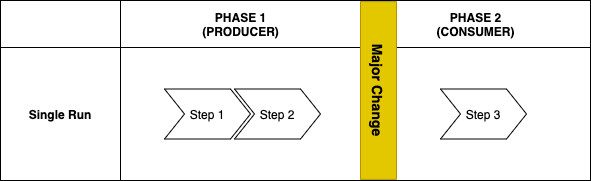
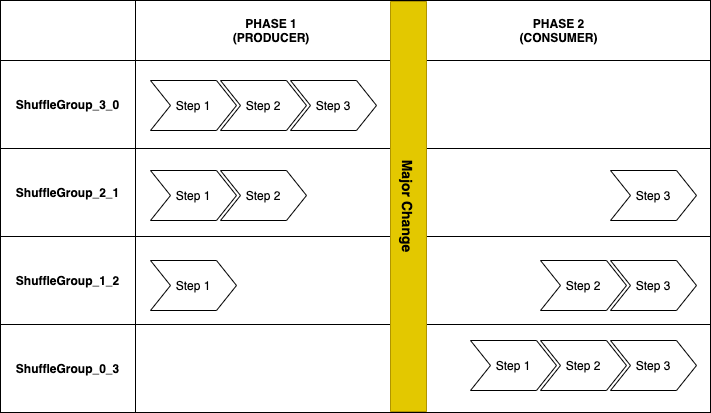
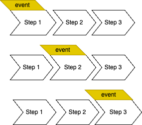

# Phased Testing (TestNG) — Legacy, Annotation-Driven Authoring

> **This is the legacy authoring style.** For new scenarios we recommend the inheritance-based
> [Mutational Testing](../mutational-testing/README.md) module. The annotation-driven style documented
> here (`phased-testing-testng`) remains fully supported, but is heavily dependent on TestNG annotations.

This module provides the original, annotation-driven way to author a mutational test scenario. Your test
class is a plain TestNG class discovered and run directly by TestNG.

For the shared concepts (scenarios as classes, events, permutations), the execution modes, the run-time
configuration, reporting and data management — all of which apply equally to this module — see the
[root README](../README.md).

## Table of Contents
<!-- TOC -->
  * [Wrapping a Scenario around an Event](#wrapping-a-scenario-around-an-event)
    * [Default Mode](#default-mode)
    * [Single Execution Mode](#single-execution-mode)
    * [Shuffled Execution Mode](#shuffled-execution-mode)
  * [Writing a Phased Test](#writing-a-phased-test)
    * [Setting Execution Modes](#setting-execution-modes)
      * [Shuffled Mode](#shuffled-mode)
      * [Single Run Mode](#single-run-mode)
      * [PHASED.TESTS.NONPHASED.LEGACY (DEPRECATED)](#phasedtestsnonphasedlegacy-deprecated)
    * [Local Execution](#local-execution)
    * [Non-Interruptive Events](#non-interruptive-events)
      * [Writing a Non-Interruptive Event](#writing-a-non-interruptive-event)
      * [Binding an Event to a Scenario](#binding-an-event-to-a-scenario)
    * [Before- and After-Phase Actions](#before--and-after-phase-actions)
    * [Nested Design Pattern](#nested-design-pattern)
  * [Data Providers](#data-providers)
<!-- TOC -->

## Wrapping a Scenario around an Event
One of the main features of Phased Testing is the ability to wrap a scenario around an event or a problem. This is done by performing a number of iterations and injecting the event at different stages of the execution of that scenario.

We have three modes of execution of a Phased Test:
* Default Mode
* Single Mode
* Shuffled Mode

### Default Mode
The steps of each scenario are executed like any other scenario in a linear predicted fashion.

### Single Execution Mode
Single Execution Mode is used only when a workflow will always be interrupted at a given stage. This is particularly relevant when your scenario will expect a time concuming external process to finish. In this case we execute all steps till the Phase End marker. When in Consumer mode, we execute the rest of the steps.



The diagram above represents what will be executed by the following code:

```java
@Test
@PhasedTest
public class ShuffledTest {

    public void step1(String val) {
        PhasedTestManager.produce("step1Val","A");
    }

    public void step2(String val) {
        String l_fetchedValue = PhasedTestManager.consume("step1Val");
        PhasedTestManager.produce("step2Val",l_fetchedValue + "B");
        
    }
    
    @PhaseEvent

    public void step3(String val) {
        String l_fetchedValue = PhasedTestManager.consume("step2Val");
        assertEquals(l_fetchedValue, "AB");
    }
}
```

### Shuffled Execution Mode
The concept of “shuffling” involves the multiple re-executions of a scenario, based on a stimulus or a requirement. In the case of Upgrades, the shuffling is based on the possible interruptions a scenario can be subject to whenever an upgrade happens.

Each re-execution or iteration is identified by what we call a Shuffle Group. The Shuffle Group also acts as a context in which the steps have a relationship and share context variables.

The code below will react differently depending on the PHASE/Execution mode it is subject to :

```java
@Test
@PhasedTest
public class ShuffledTest {

    public void step1(String val) {
        PhasedTestManager.produce("A1");
    }

    public void step2(String val) {
        String l_fetchedValue = PhasedTestManager.consume("A1");
        PhasedTestManager.produce("B1",l_fetchedValue + "B");
        
    }

    public void step3(String val) {
        String l_fetchedValue = PhasedTestManager.consume("B1");
        assertEquals(l_fetchedValue, "AB");
    }
}
```

##### Shuffled - Interruptive
When a shuffled test is executed in an interruptive mode (Phases PRODUCER and CONSUMER), we execute all the possible ordered combinations interruptions the scenario can be subject to. Example Given a test with three steps, in Producer State, we :
1. Execute all the three steps
2. Execute the first two steps
3. Execute the first step only

When in Consumer state we :
1. Execute the two last steps
2. Execute the last step
3. Execute all the steps




##### Shuffled - Non-Interruptive 
As of version 8, we are introducing the asynchronous phase mode. Asynchronous phases are destined for non-interruptive events. They allow you to inject an event during the execution of the steps of a scenario. An asynchronous execution of a shuffled test, will shuffle the test, but will for each phase group execute, in parallel, the given event for each step.

Example:



## Writing a Phased Test
This is the annotation-driven authoring model, provided by the `phased-testing-testng` module. Your test
class is a plain TestNG class discovered and run directly by TestNG.

You need to register `PhasedTestListener` for phased tests to be recognized, either on your suite in
`testng.xml`:

```xml
<suite name="My Suite">
    <listeners>
        <listener class-name="com.adobe.campaign.tests.integro.phased.PhasedTestListener"/>
    </listeners>
    ...
</suite>
```

or with the `@Listeners` annotation on your test class.

The Phased Testing is activated using two annotations:
* **@PhasedTest** : Class level annotation. Allows you to control how the test should be executed
* **@PhaseEvent** : Method level annotation. By setting it you tell the system at which step does the phase event happen. The tests will stop at that point.

Moreover, you need to :
* Make your methods accept at least one argument
* Due to the TestNG standards, the methods will be executed, by default in an alphabetical order. So prefixing the methods with their step number is a good practice. 

Note : As of version 7.0.11, we now have the possibility to let the framework pick the order for us.

### Setting Execution Modes

#### Shuffled Mode
In order for a test scenario to be executed in shuffle mode you need to add the following annotation at the class level `@PhasedTest`

#### Single Run Mode
In order for a test scenario to be executed in single run mode you simply need to set the annotation `@PhaseEvent` somewhere along its steps. The location of this annotation is where you expect the interruption to occur.

Optionally if you consider that the scenario can never be run as non-phased, you need also include:  `@PhasedTest(executeInactive = false)`. When executeInactive is false, the Single Run scenario will only run when in Phases.

#### PHASED.TESTS.NONPHASED.LEGACY (DEPRECATED)

For versions < 8.0.0 we had a bug where the default execution mode was executed in a phase group called "phased-data-provider-single". This was incorrect, and as of version 8.0.0 the default execution mode of a phased test is "phased-default". Due to backward compatibility, we allow users to keep the old mode if they chose to by setting this system property.

This property is deprecated, as it exists only to opt back into the old buggy behavior. A warning is logged at suite start if it is set.

### Local Execution
Whenever the Phased Test Listener discovers a Phased Test, it will automatically add the data provider needed for running the test, so in the standard case you don't need to declare one yourself:

```
@PhasedTest
public class MyPhasedTest {
}
```

For the listener to be discovered, it needs to be declared — either via `<listeners>` in `testng.xml` or the `@Listeners` annotation. However, `testng.xml` is not always taken into account when running a single test directly from an IDE, in which case the listener never gets registered. Declaring `PhasedTestListener` via the TestNG `ServiceLoader` mechanism (`META-INF/services/org.testng.ITestNGListener`) covers this case too, since it is picked up by TestNG regardless of how the test is launched. This is the recommended approach.

If for any reason you can't rely on the `ServiceLoader` mechanism, you can set the default data provider explicitly to guarantee local execution still works even when the listener isn't registered:

```
@Test( dataProvider = PhasedDataProvider.DEFAULT, dataProviderClass = PhasedDataProvider.class)
@PhasedTest
public class MyPhasedTest {
}
```

### Non-Interruptive Events
In the case of non-interruptive events there are a few things to consider:
* Writing an Event
* Binding an Event to a Scenario

The event API itself (`NonInterruptiveEvent`) is part of the shared core engine — see
[Event Management and Execution](../README.md#event-management-and-execution) for the underlying concept.
This section covers how you write an event and bind it to an annotation-driven Phased Test.

#### Writing a Non-Interruptive Event
In order have some level of predictability for non-interruptive events, we have defined an api for non-interruptive events. For an event to be able to be used by the Phased Tests it needs to inherit from the abstract class `com.adobe.campaign.tests.integro.phased.NonInterruptiveEvent` which extends `Runnable`.

In the example before we have created an event `NonInterruptiveEventExample`:
```java
public class NonInterruptiveEventExample extends NonInterruptiveEvent {
  @Override
  public boolean startEvent() {
    return false;
  }

  @Override
  public boolean isFinished() {
    return false;
  }

  @Override
  public boolean waitTillStarted() {
    return false;
  }
}
```

As you can see we have to implement three methods:
* `startEvent` starts the event.
* `isFinished` allow the system to see if the event we declared has finished.
* `waitTillStarted` waits until the event has started, i.e. the startUp stage has been finalized.

In order to define these event you will need to implement these methods, as you who are defining the event have the best knowledge on how these event will work.

##### Performing Event Cleanup Actions
At times the simple execution of an event is not sufficient. We need to perform an event clean up action to reset the system to a stable state. For this we allow you to define a 'tearDownEven' actions for an event. This means that after an event has been finished, we perform an additional set of actions before the next step is executed. To make use of this you need to override the method `tearDownEvent` in your event. The framework will then execute this action right before the next step is triggered.

```java
@Override
public boolean tearDownEvent() {
        // Perform actions
        return true; //Return true if the actions were successful
        }
```

#### Binding an Event to a Scenario
In order for your scenario to interact with an event you will need to declare it. This can be done in three ways (in order of precedence) :
* Phased Event Annotation
* Phased Test Annotation
* Test Suite Definition

If you have the event declared in more than one level (for example on both the PhasedEvent and the PhasedTest annotation), it is the value with more precedence which is taken into account.

##### Attaching an Event using the PhaseEvent Annotation
The mode is only applicable to Single Run execution modes.

In the case of single run scenarios, we can specify which phase event should be triggered on the annotation itself. This is by setting the `eventClasses` attribute for the `@PhaseEvent` annotation.

In the example below the PhaseEvent is always executed at the step2 of the scenario. Here we have specified that when we are in asynchroous mode only the event `com.adobe.campaign.tests.integro.phased.data.events.MyNonInterruptiveEvent` should be executed. 
```Java
@PhasedTest
@Test
public class SingleRunScenarioWithEvent {

    public void step1(String val) {
        PhasedTestManager.produceInStep("A");
    }

    @PhaseEvent(eventClasses = {"com.adobe.campaign.tests.integro.phased.data.events.MyNonInterruptiveEvent"})
    public void step2(String val) {
        String l_fetchedValue = PhasedTestManager.consumeFromStep("step1");
        PhasedTestManager.produceInStep(l_fetchedValue + "B");
    }

    public void step3(String val) {
        String l_fetchedValue = PhasedTestManager.consumeFromStep("step2");

        assertEquals(l_fetchedValue, "AB");
    }
}
```

##### Attaching an Event using the PhasedTest Annotation
In this case we expect us to specify if a scenario is only subject to the same event. This will be done at the `@PhasedTest` annotation using the attribute `eventClasses`. When set we only use the specified event.

```Java
@PhasedTest(eventClasses = {"com.adobe.campaign.tests.integro.phased.data.events.MyNonInterruptiveEvent"})
@Test
public class ShuffledScenarioWithEvent {

    public void step1(String val) {
        PhasedTestManager.produce("step1Value","A");
    }
    
    public void step2(String val) {
        String l_fetchedValue = PhasedTestManager.consume("step1Value");
        PhasedTestManager.produce("Step2Value", l_fetchedValue + "B");
    }

    public void step3(String val) {
        String l_fetchedValue = PhasedTestManager.consume("Step2Value");

        assertEquals(l_fetchedValue, "AB");
    }
}
```

##### Attaching an Event to the Test Suite
In this case, we state that all scenarios should be using the same Event. We can activate this mode by setting the environment variable `PHASED.EVENTS.NONINTERRUPTIVE` to the event class.

This works for both Shuffled and Single-Run tests. If we want to run all tests with the event `com.adobe.campaign.tests.integro.phased.data.events.MyNonInterruptiveEvent`, we enter:

```mvn clean test -DPHASED.EVENTS.NONINTERRUPTIVE=com.adobe.campaign.tests.integro.phased.data.events.MyNonInterruptiveEvent```

You can also add it as a property in your testng definition file.

##### Targeting an Event to a Specific Step
As of version 8.11.2, we can inject an event to a specific step of a Phased Scenario. This is done by:
* Declaring an event by setting the variable `PHASED.EVENTS.NONINTERRUPTIVE`.
* Identifying the step on which an event will occur. This is done by setting the variable `PHASED.EVENTS.TARGET`.

The step should point to a method. For method `step1` in the class `a.b.c.ScenarioA` you can set:
* `a.b.c.ScenarioA.step1`
* `ScenarioA#step1`
* `ScenarioA.step1`

In the case of nested tests, for method `step1` in the class `a.b.c.ScenarioA`, and sub-class `NestedClassB` you need to use the `$` notation. It will look like:
* `a.b.c.ScenarioA$NestedClassB.step1`
* `ScenarioA$NestedClassB#step1`
* `ScenarioA$NestedClassB.step1`

Here is an example of running a specific event for a specific test:

```mvn clean test -DPHASED.EVENTS.NONINTERRUPTIVE=com.adobe.campaign.tests.integro.phased.data.events.MyNonInterruptiveEvent -DPHASED.EVENTS.TARGET=ScenarioA$NestedClassB#step1 ```


### Before- and After-Phase Actions
We have introduced the possibility of defining Before and After Phases. This means that you can state if a method can be invoked before or after the phased tests are executed. These methods are only activated when we are in a Phase, and will not run when executed when we execute the scenarios in Non-Phased mode. 

However, Before/After Phase methods are like any other Before/After method as, when invoked, they will affect all underlying tests, even if they are not Phased Tests.

To activate this functionality you add the annotations `@BeforePhase` & `@AfterPhase` to a TestNG configuration method such as: **@BeforeSuite, @AfterSuite, @BeforeGroups, @AfterGroups, @BeforeTest and @AfterTest**.

To your configuration method. Example:

```java
@BeforePhase
@BeforeSuite
public void myBeforePhaseSuite() {
    //Perform actions
}
```

In the example above the method `myBeforePhaseSuite` will be invoked in the beginning of the suite. By default, the BeforePhase method is invoked when we are in a Phase I.e. Producer or Consumer.

You can configure this with the attribute `appliesToPhases`, which accepts an array of `Phases`. In the example below we are activating AfterPhase for the Consumer phase only.


 ```java
@AfterPhase(appliesToPhases = {Phases.CONSUMER})
@AfterSuite
public void myAfterPhasedSuite() {
    //Perform actions
}
```

### Nested Design Pattern
As of version 7.0.9 of Phased Testing which is based on the 7.5 of TestNG, we can now define nested Phased tests. This allows you to regroup the phased tests under the same class. Thus, you will have Phased Tests that resemble method based tests.

Example:
```java
public class PhasedTestSeries_NestedContainer {
  @Test
  @PhasedTest
  public class PhasedScenario1 {

    public void step1(String val) {
      PhasedTestManager.produce("myValX","A");
    }

    public void step2(String val) {
      String l_fetchedValue = PhasedTestManager.consume("myValX");

      assertEquals(l_fetchedValue, "A");
    }
  }

  @Test
  @PhasedTest
  public class PhasedScenario2 {

    public void step1(String val) {
      PhasedTestManager.produce("MyVal1","AB");
    }
    
    public void step2(String val) {
      String l_fetchedValue = PhasedTestManager.consume("MyVal1");

      assertEquals(l_fetchedValue, "AB");
    }

  }

}
```

To run a nested test, see [Running Nested Phased Tests](../README.md#running-nested-phased-tests) in the
shared configuration reference.

## Data Providers
We now allow for a user to also include data providers in connection to Phased Tests. The Data Provider parameters will, when executed in a Phased Test, be added to the test result.

A configuration check is done in the beginning. The phased test steps are checked and their arguments are compared to the number of data providers + the injected data provider for phased tests. If the number of arguments does not correspond to the total number of data providers, a `PhasedTestConfigurationException` is thrown right at the beginning.
